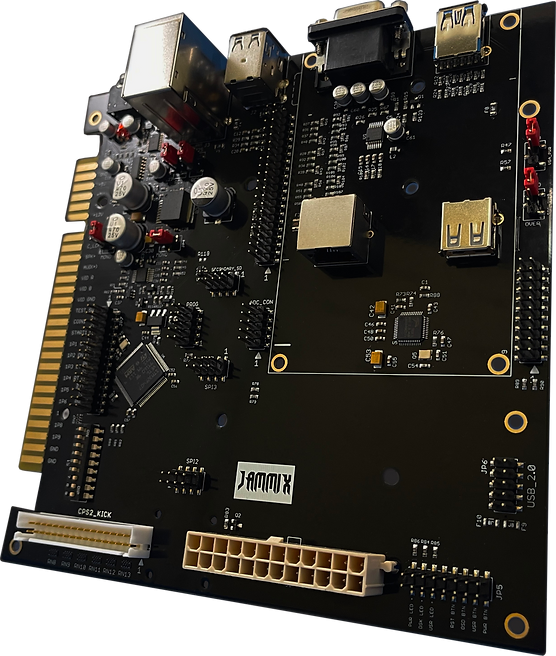
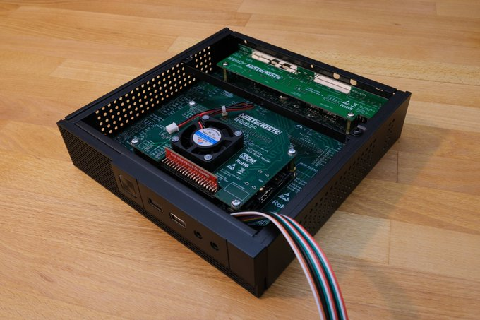
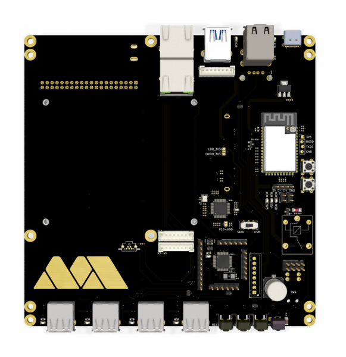
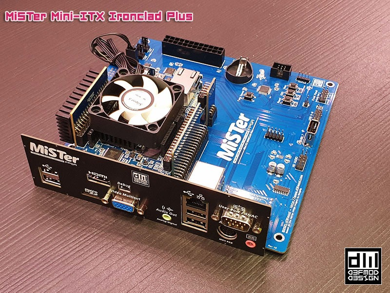
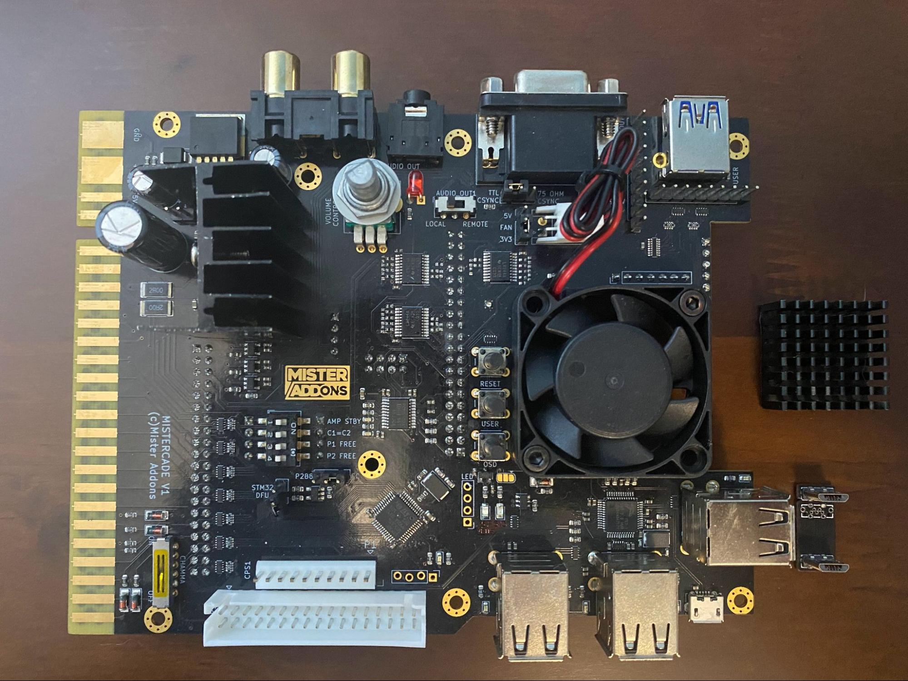
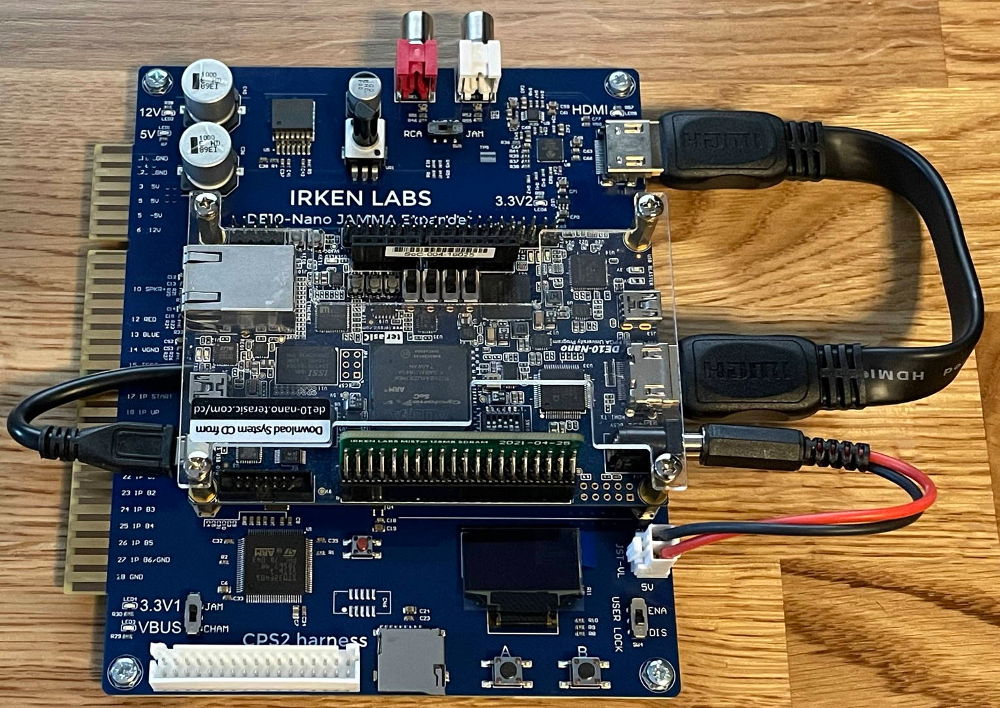
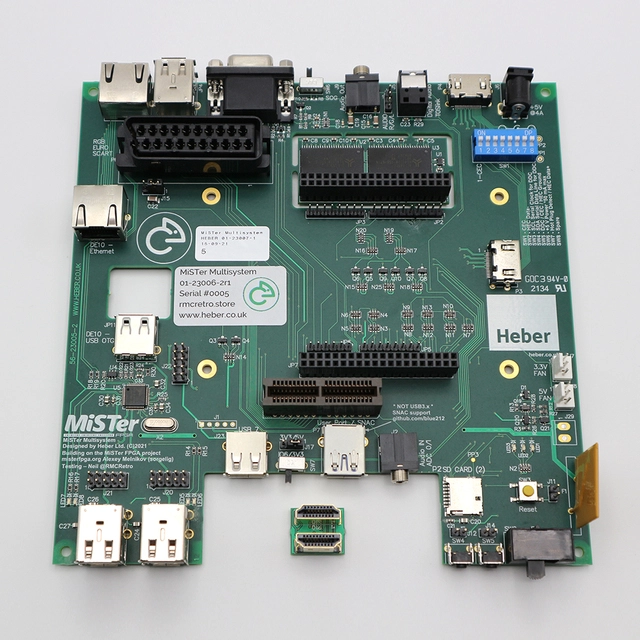

# MiSTer Board Options

(As of Novembre 2020)

## Jammix

**URL:** https://www.jammix.io/  
**Twitter:** https://twitter.com/JammixO  
**Price:** $225  
**Availability:** Available (Nov. 2021)

## MiSTerKiSTe

**URL:**  
**Twitter:** https://twitter.com/QuakTec  
**Price:** ?  
**Availability:**

## Mister Addons MiSTer Express

**URL:** https://misteraddons.com/blogs/news/time-flies-when-youre-having-fun  
**Twitter:** https://twitter.com/MisterAddons  
**Price:** TBD  
**Availability:**

## d3fmod MiSTer Mini-ITX Ironclad Plus

**URL:** https://www.d3fmod.com/mini-itx-ironclad-plus/  
**Twitter:** https://twitter.com/d3fmod  
**Price:** €150.– (CHF 160.–)  
**Availability:** Out of stock

## Mister Addons MiSTerCade

**URL:** https://misteraddons.com/products/mistercade  
**Twitter:** https://twitter.com/MisterAddons  
**Price:** $185  
**Availability:** Sold out

## Irken Labs JAMMA Expander

**URL:** https://irkenlabs.com/jamma-expander/introduction  
**Twitter:** https://twitter.com/IrkenLabs  
**Price:** NOK 1’550 (CHF 165.–)  
**Availability:** Restock Dec 2021

## MiSTer Multisystem

**URL:** https://rmcretro.store/mister-multisystem/  
**Twitter:** https://twitter.com/RMCretro  
**Price:** £176 (CHF 218.–)  
**Availability:** Q2 2022

