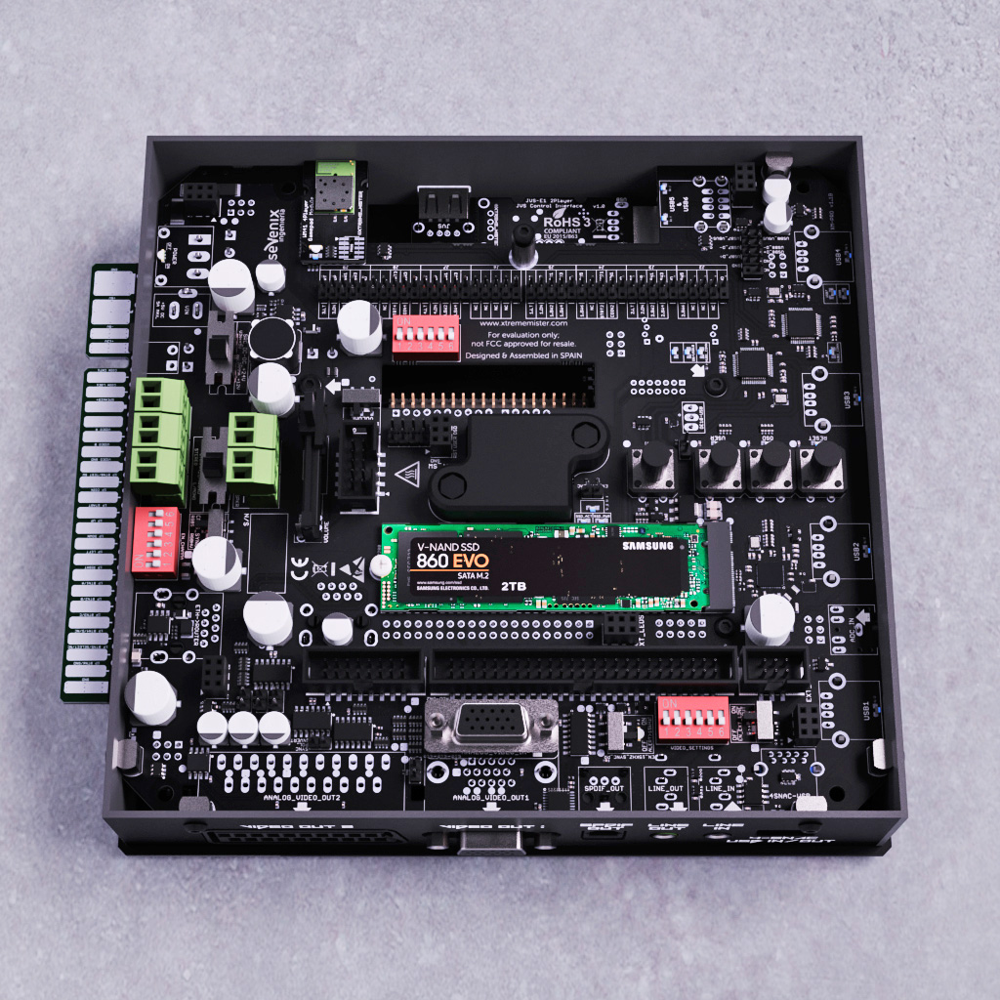

# MiSTer Board Options

(As of November 2021)

## Jammix

**URL:** [https://www.jammix.io/](https://www.jammix.io/)  
**Twitter:** [@JammixO](https://twitter.com/JammixO)  
**Price:** [USD 225](https://duckduckgo.com/?q=usd+225+in+eur)  
**Availability:** Available (Nov. 2021)

## MiSTerKiSTe

**URL:**  
**Twitter:** [@QuakTec](https://twitter.com/QuakTec)  
**Price:** TBD  
**Availability:** In development.

## Mister Addons MiSTer Express

**URL:** [https://misteraddons.com/blogs/news/time-flies-when-youre-having-fun](https://misteraddons.com/blogs/news/time-flies-when-youre-having-fun)  
**Twitter:** [@MisterAddons](https://twitter.com/MisterAddons)  
**Price:** TBD  
**Availability:** In development.

## d3fmod MiSTer Mini-ITX Ironclad Plus

**URL:** [https://www.d3fmod.com/mini-itx-ironclad-plus/](https://www.d3fmod.com/mini-itx-ironclad-plus/)  
**Twitter:** [@d3fmod](https://twitter.com/d3fmod)  
**Price:** [EUR 165](https://duckduckgo.com/?q=eur+165+in+usd) (USD 187)  
**Availability:** Available

## Mister Addons MiSTerCade

**URL:** [https://misteraddons.com/products/mistercade](https://misteraddons.com/products/mistercade)  
**Twitter:** [@MisterAddons](https://twitter.com/MisterAddons)    
**Price:** [USD 225](https://duckduckgo.com/?q=usd+225+in+eur)  
**Availability:** Available

## Irken Labs JAMMA Expander

**URL:** https://irkenlabs.com/jamma-expander/introduction  
**Twitter:** [@IrkenLabs](https://twitter.com/IrkenLabs)  
**Price:** [NOK 1’750](https://duckduckgo.com/?q=nok+1750+in+usd) (USD 197)    
**Availability:** Available

## MiSTer Multisystem

**URL:** [https://rmcretro.store/mister-multisystem/](https://rmcretro.store/mister-multisystem/)  
**Twitter:** [@RMCretro](https://twitter.com/RMCretro)  
**Price:** [GPB 176](https://duckduckgo.com/?q=gbp+176+in+usd) (USD 238)  
**Availability:** Batch #3 to be announced.

## XTREME-MISTER FPGA

**URL:** [http://xtrememister.com/](http://xtrememister.com/)  
**Twitter:** [@xtreme_mister](https://twitter.com/xtreme_mister)  
**Price:** TBD  
**Availability:** In development.

